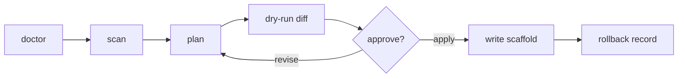

<div align="center">

<picture>
  <source media="(prefers-color-scheme: dark)" srcset="docs/assets/metis-wordmark.svg" />
  <source media="(prefers-color-scheme: light)" srcset="docs/assets/metis-wordmark-light.svg" />
  
</picture>

### The local rule engine for coding agents that need taste, memory, and restraint.

Metis turns **repeated AI coding corrections** into **personal**, **local**,
**reviewable**, and **reversible** project rules. It reads the guidance and
signals already living in your repo, proposes compact agent scaffolds, previews
the exact diff, and writes only after you approve.

[Quick Start](#quick-start) | [How It Works](#how-it-works) | [Safety Model](#safety-model) | [Docs](#docs)


</div>

---

## Why Metis Exists

Every serious codebase teaches its agents the same lessons over and over:

| Before | After |
| --- | --- |
| "Run the real test command before answering." | Metis turns the correction into a short scaffold rule. |
| "Keep responses in the project's language." | Metis ties the preference to local evidence. |
| "Stop editing generated files casually." | Metis marks risk, target paths, and review state. |
| "Do not bloat the prompt with every passing thought." | Metis keeps the output compact and reversible. |

Most tools either forget these corrections, bury them in chat history, or ask
you to hand-maintain giant instruction files. Metis sits in the middle: a
local review layer for agent behavior.

It does not replace your coding agent. It makes the rules around your agent
sharper.

## How It Works

```text
              local evidence
                   |
                   v
        +----------------------+
        |        Metis         |
        | scan -> plan -> diff |
        +----------------------+
                   |
        review, approve, rollback
                   |
                   v
          compact agent scaffold
```

Metis is built for developers who want their agents to feel calibrated without
giving up control. It is small on purpose: read the repo, propose rules, show
the diff, protect secrets, and leave a rollback trail.

## The Loop



The default path is read-only. Mutation is explicit.

## What You Get

| Layer | What Metis does | Why it matters |
| --- | --- | --- |
| Evidence | Finds project guidance, package scripts, docs, and bounded agent signals. | Rules come from the repo, not vibes. |
| Planning | Produces candidates with evidence ids, confidence, target files, and risk. | You can judge the rule before it lands. |
| Diffing | Shows generated scaffold changes before write. | No silent prompt drift. |
| Terminal UI | Guides scan, plan, preview, apply, rollback, and proposals. | The main workflow stays fast in the terminal. |
| Dashboard | Exports a static read-only HTML review surface. | Share or inspect state without giving it mutation powers. |
| Rollback | Records restore data before applying changes. | Every write has a way back. |

## Quick Start

```bash
npm install
npm run check
```

Run the read-only path against the included fixture:

```bash
node bin/metis.js doctor --fixture test/fixtures/mixed-agent-project
node bin/metis.js scan --fixture test/fixtures/mixed-agent-project
node bin/metis.js plan --fixture test/fixtures/mixed-agent-project
node bin/metis.js init --dry-run --fixture test/fixtures/mixed-agent-project
```

Apply only after reviewing the dry-run output:

```bash
node bin/metis.js init --apply --yes --fixture <project-root>
node bin/metis.js rollback <rollback-id> --fixture <project-root>
```

## Command Surface

| Command | Role | Writes |
| --- | --- | --- |
| `metis doctor` | Check environment and artifact health. | No |
| `metis scan` | Gather local evidence. | No |
| `metis plan` | Print candidate rules. | No |
| `metis note "<correction>"` | Capture one repeated correction (redacted, local). | Appends to corrections log |
| `metis learn --dry-run` | Preview corrections found in local transcripts or git history. | No |
| `metis learn --yes` | Capture discovered corrections into the redacted log. | Appends to corrections log |
| `metis init --dry-run` | Preview scaffold diffs. | No |
| `metis init --apply --yes` | Apply approved scaffold changes. | Yes |
| `metis rollback <id>` | Restore files from rollback metadata. | Yes |
| `metis evolve --dry-run` | Propose small updates to existing candidates. | No |
| `metis tui` | Run the terminal-first review workflow. | Only after confirmation |
| `metis gui --preview` | Export a static read-only dashboard. | Requested HTML only |
| `metis agents` | List supported agent CLIs and detect which are installed. | No |
| `metis run <agent> "<prompt>" --dry-run` | Preview the exact agent CLI command. | No |
| `metis run <agent> "<prompt>" --yes` | Drive a local agent CLI and capture output. | Runs a local CLI |

Metis runs as zero-dependency CommonJS on Node.js 18 or newer.

## Terminal First

```bash
node bin/metis.js tui \
  --fixture test/fixtures/mixed-agent-project \
  --script test/fixtures/tui/dry-run.txt
```

The TUI is the primary review room: scan evidence, inspect candidates, preview
diffs, save proposals, apply with an exact confirmation phrase, and rollback
when needed.

## Static Review Dashboard

```bash
node bin/metis.js gui --preview \
  --fixture test/fixtures/mixed-agent-project \
  --out /tmp/metis-preview.html
```

The dashboard is intentionally read-only. It gives you search, filters, detail
views, audit state, diff preview, rollback ledger, and redacted JSON export
without adding mutation controls.

## Drive Your Agent CLIs

Metis can also *drive* the coding-agent CLIs you already have installed, as local
subprocesses. The design mirrors a per-agent skill file: one normalized spec per
agent describing how to launch it, pass a prompt, and continue a session.

```bash
# Preview the exact command first (runs nothing, writes nothing):
node bin/metis.js run claude "summarize the open TODOs" --dry-run

# Then execute it and capture the output:
node bin/metis.js run claude "summarize the open TODOs" --yes

# Multi-turn session, or hand the terminal to the agent's own interface:
node bin/metis.js run codex --interactive --yes
node bin/metis.js run opencode --attach --yes
```

Supported agents: `claude`, `codex`, `opencode`, `cursor`. Run `metis agents` to see
which are installed and which config files each one uses in the current project.

Execution is opt-in and explicit: every run requires `--dry-run` (preview only) or
`--yes` (execute). Metis itself performs no network I/O; it only launches a local CLI
you already trust, and passes an agent's skip-confirmation flag only when you add
`--yolo`. Point Metis at a specific binary with `METIS_DRIVER_BIN_<AGENT>` when needed.

## Learn From Repeated Corrections

The sharpest rules come from the lessons you keep repeating to your agent. Metis
captures those corrections explicitly, never by watching you in the background.

```bash
# Record one correction by hand the moment it happens:
node bin/metis.js note "don't edit generated files directly"

# Or harvest corrections you already made, from sources you choose:
node bin/metis.js learn --source git --dry-run      # revert/undo commits (local, read-only)
node bin/metis.js learn --source claude --dry-run    # your Claude Code transcripts for this project
node bin/metis.js learn --source all --yes           # capture from every source
```

Metis classifies a turn as a correction when it negates ("don't / stop / 不要"),
re-instructs ("actually / I said / 我说过"), or undoes ("revert / 撤销") prior work.
Every captured line is redacted before it touches the log. Frequency is the
signal: a correction seen once stays documentation-only, while one repeated
across sessions climbs toward a generated rule. Review the result with
`metis plan` and apply it like any other candidate.

Transcript reading is strictly opt-in: nothing is read until you run
`metis learn --source claude` (or `all`), and the corrections log lives locally
at `.metis/corrections/log.jsonl`.

## Generated Targets

`init --dry-run` can propose scaffold changes for:

| Path | Purpose |
| --- | --- |
| `AGENTS.md` | Codex project guidance. |
| `CLAUDE.md` | Claude Code project guidance. |
| `.cursor/rules/personal-agent.mdc` | Cursor project rules. |
| `.metis/evidence/index.json` | Redacted local evidence index. |

Generated sections are bounded by stable markers:

```text
<!-- METIS:BEGIN -->
<!-- METIS:END -->
```

Manual content outside those markers is preserved.

## Safety Model

Metis treats agent instructions as production infrastructure.

| Boundary | Guarantee |
| --- | --- |
| Local first | No accounts, API keys, remote calls, or telemetry in core workflows. |
| Review first | Scan, plan, and dry-run do not mutate target scaffold files. |
| Explicit apply | CLI apply requires apply flags; TUI apply requires typing `APPLY METIS`. |
| Whitelisted writes | Apply writes only known scaffold and artifact paths. |
| Secret handling | Secret-like values, private paths, prompt-injection markers, and risky evidence are redacted or blocked. |
| Explicit learning | Corrections are captured only by `metis note` or an explicit `metis learn`; transcripts are never read in the background, and every record is redacted before it lands in the log. |
| Rollback before write | Restore metadata is created before scaffold mutation. |
| Explicit drive | `metis run` launches a local agent CLI only after a `--dry-run` preview and an explicit `--yes`; Metis sends nothing over the network. |

## Philosophy

Metis is for instruction hygiene.

Not a memory cloud. Not a model gateway. Not an agent runtime of its own — when
asked, it drives the agent CLIs you already run. Not a pile of prompts pretending
to be a system.

It is a compiler for the instruction layer: find the repeated lesson, compress
it into a rule, show the evidence, and let the human decide whether it belongs
in the scaffold.

## Docs

| Document | Start here when you need |
| --- | --- |
| [Architecture](docs/ARCHITECTURE.md) | Internal module boundaries and data flow. |
| [Product-grade baseline](docs/PRODUCT-GRADE.md) | Release quality expectations and guardrails. |
| [Proposal lifecycle](docs/PROPOSALS.md) | Saved proposal states and review flow. |
| [Migration notes](docs/MIGRATION.md) | Compatibility and transition details. |
| [Troubleshooting](docs/TROUBLESHOOTING.md) | Common failure modes. |
| [Release process](docs/RELEASE.md) | Maintainer release checklist. |
| [Security policy](SECURITY.md) | Reporting and sensitive-data rules. |
| [Contributing](CONTRIBUTING.md) | How to help without weakening the boundary. |

## Development

```bash
npm run check
npm run smoke:install
npm run qa:product
npm test
```

Local QA commands may generate ignored evidence under `.omo/`. Those artifacts
are useful for release checks but are not meant to be committed.

## Non-Goals

- No hosted account layer.
- No model gateway.
- No automatic self-evolution.
- No silent transcript reading. Transcripts are read only when you run `metis learn`.
- No mutation controls in the static dashboard.

## License

MIT License. See [LICENSE](LICENSE).
