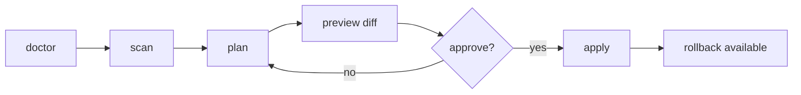

<div align="center">

# Metis

**Turn repeated AI coding corrections into personal, local, reviewable, reversible rules.**

Metis is a small local tool for teams and solo developers who keep teaching AI
coding agents the same lessons. It gathers evidence already in your project,
turns repeated AI coding corrections into short scaffold rules, previews every
change, and writes only after you approve.

[Quick Start](#quick-start) · [Workflow](#workflow) · [Commands](#commands) · [Safety](#safety-boundary)

</div>

---

## Before / After

| Before | After |
| --- | --- |
| "Run the real test command before answering." | Metis finds the repeated pattern and proposes a concise rule. |
| "Keep replies in Simplified Chinese for this repo." | Metis links the rule to local evidence and shows confidence/risk. |
| "Do not turn every preference into a giant prompt." | Metis keeps the scaffold short, reviewable, and reversible. |

Metis is not a hosted memory product and not a second agent. It is a quiet,
local review room for the rules that make coding assistants behave more like
they belong to your project.

## What Metis Does

| Capability | Result |
| --- | --- |
| Read-only scan | Collects project guidance, package scripts, docs, and bounded agent evidence. |
| Candidate planning | Proposes short rules with evidence ids, confidence, targets, and risk. |
| Diff preview | Shows exactly what would change before any file is written. |
| Terminal workflow | Provides a guided TUI for scan, plan, preview, apply, rollback, and proposals. |
| Static dashboard | Exports a read-only HTML review page for evidence, candidates, audit, and diffs. |
| Rollback first | Writes rollback metadata before mutating whitelisted scaffold files. |

## Workflow



First run is read-only by default. Apply only after you have reviewed the dry-run
output from the CLI or TUI.

## Quick Start

```bash
npm install
npm run check

node bin/metis.js doctor --fixture test/fixtures/mixed-agent-project
node bin/metis.js scan --fixture test/fixtures/mixed-agent-project
node bin/metis.js plan --fixture test/fixtures/mixed-agent-project
node bin/metis.js init --dry-run --fixture test/fixtures/mixed-agent-project
```

Review the dry-run output, then apply to a copied fixture or real project root:

```bash
node bin/metis.js init --apply --yes --fixture <project-root>
node bin/metis.js rollback <rollback-id> --fixture <project-root>
```

## Commands

| Command | Purpose | Writes |
| --- | --- | --- |
| `metis doctor` | Check environment and artifact health | No |
| `metis scan` | Gather local evidence | No |
| `metis plan` | Print candidate rules | No |
| `metis init --dry-run` | Preview scaffold diffs | No |
| `metis init --apply --yes` | Apply approved scaffold changes | Yes |
| `metis rollback <id>` | Restore files from rollback metadata | Yes |
| `metis evolve --dry-run` | Propose small updates to existing candidates | No |
| `metis tui` | Run the terminal-first review workflow | Only after confirmation |
| `metis gui --preview` | Export a static read-only dashboard | Writes the requested HTML file |

Runtime is zero-dependency CommonJS on Node.js 18 or newer.

## TUI And GUI

Run the guided terminal workflow:

```bash
node bin/metis.js tui --fixture test/fixtures/mixed-agent-project --script test/fixtures/tui/dry-run.txt
```

Export a static review dashboard:

```bash
node bin/metis.js gui --preview --fixture test/fixtures/mixed-agent-project --out /tmp/metis-preview.html
```

The dashboard supports search, filters, detail views, and redacted JSON export.
It is read-only and does not include mutation controls.

## Generated Files

`init --dry-run` can propose changes for:

| Path | Role |
| --- | --- |
| `AGENTS.md` | Codex project guidance |
| `CLAUDE.md` | Claude Code project guidance |
| `.cursor/rules/personal-agent.mdc` | Cursor project rules |
| `.metis/evidence/index.json` | Redacted local evidence index |

Generated sections are wrapped with stable markers:

```text
<!-- METIS:BEGIN -->
<!-- METIS:END -->
```

Manual content outside those markers is preserved.

## Safety Boundary

| Boundary | Guarantee |
| --- | --- |
| Local first | No accounts, API keys, remote calls, or telemetry in core workflows. |
| Review first | Scan, plan, and dry-run do not mutate target scaffold files. |
| Explicit apply | TUI apply requires typing `APPLY METIS`; CLI apply requires an apply flag. |
| Whitelisted writes | Apply writes only known scaffold/artifact paths. |
| Secret handling | Secret-like values, private paths, and risky evidence are redacted or blocked. |
| Reversible changes | Rollback metadata is created before scaffold writes. |

## Documentation

- [Architecture](docs/ARCHITECTURE.md)
- [Product-grade baseline](docs/PRODUCT-GRADE.md)
- [Proposal lifecycle](docs/PROPOSALS.md)
- [Migration notes](docs/MIGRATION.md)
- [Troubleshooting](docs/TROUBLESHOOTING.md)
- [Release process](docs/RELEASE.md)
- [Security policy](SECURITY.md)
- [Contributing](CONTRIBUTING.md)

## Development

```bash
npm run check
npm run smoke:install
npm run qa:product
npm test
```

Local QA commands may generate ignored evidence under `.omo/`. Those artifacts
are useful for release checks but are not meant to be committed.

## Non-Goals

- No hosted account layer.
- No model gateway.
- No automatic self-evolution.
- No silent transcript reading.
- No mutation controls in the static dashboard.

## License

MIT License. See [LICENSE](LICENSE).
